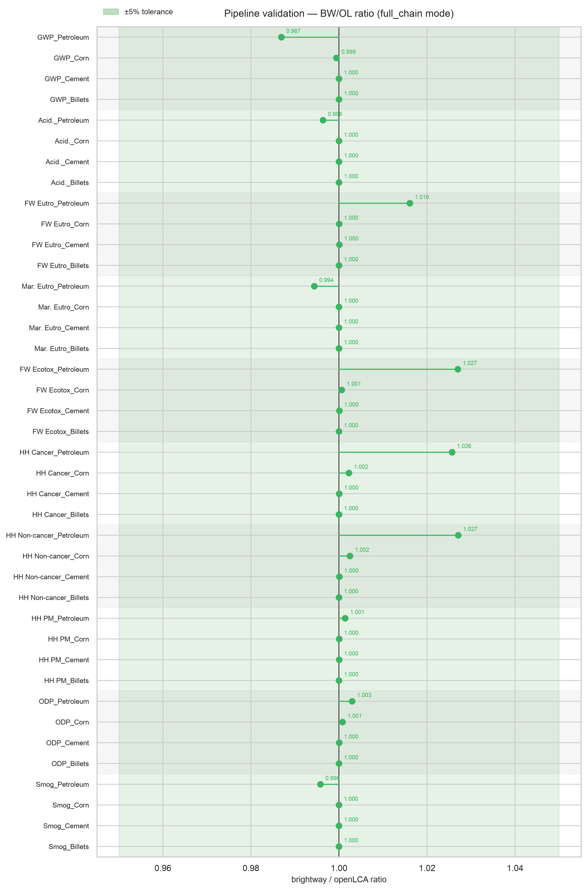
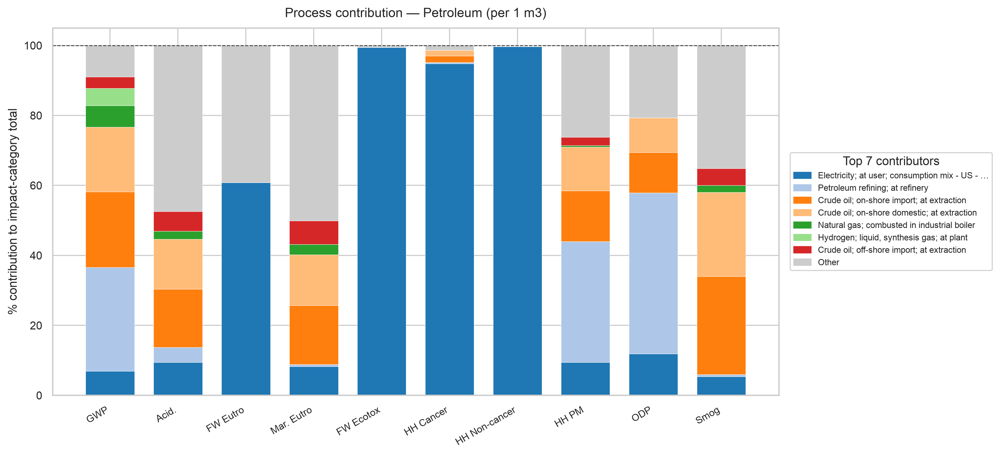
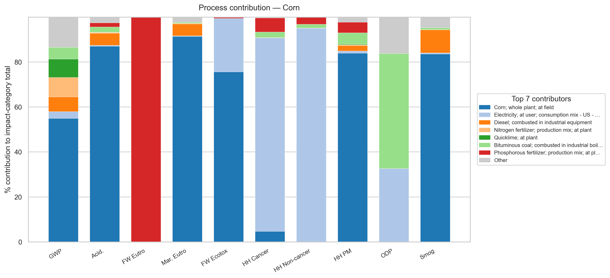
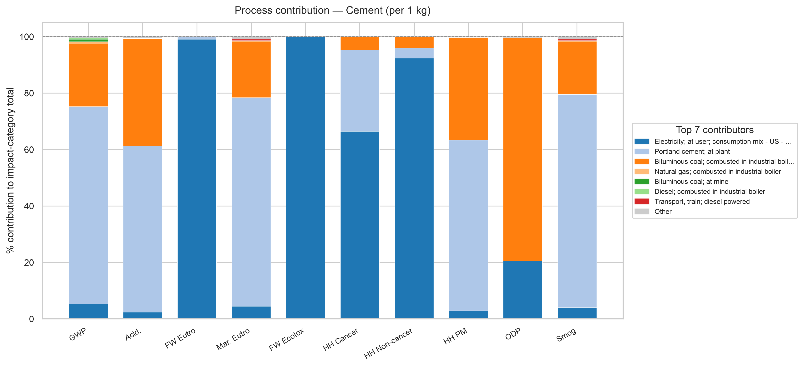
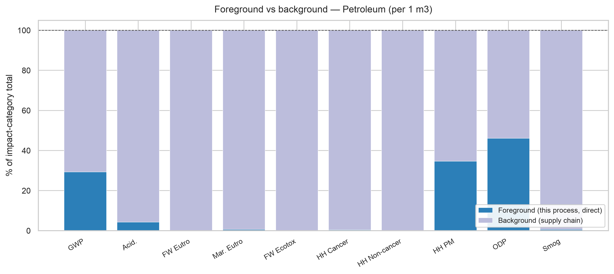
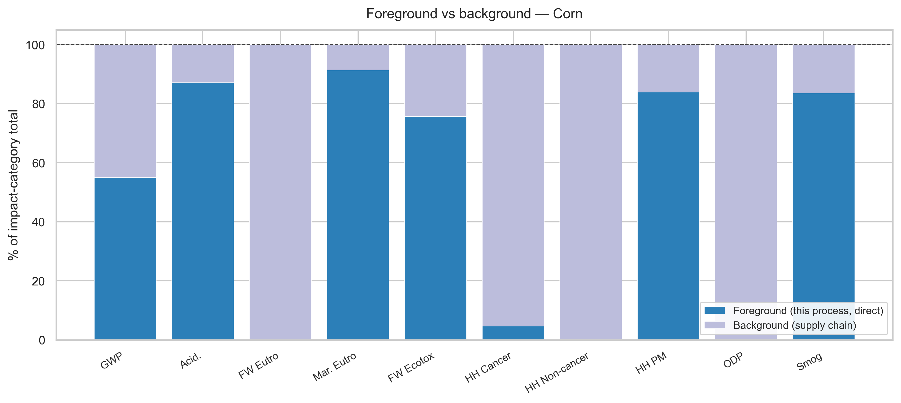
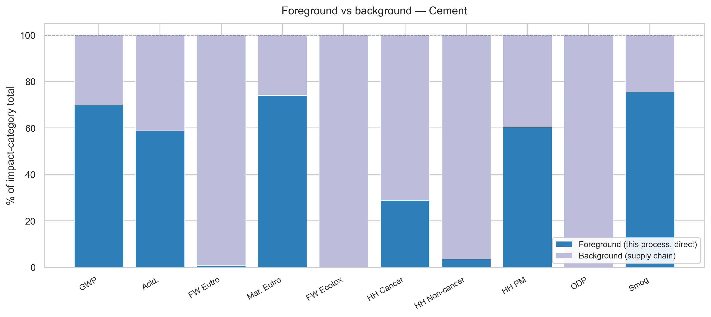

# Validating an open-source USLCI + TRACI pipeline against openLCA

**The short version:** I built an LCA pipeline on brightway that reads USLCI processes,
handles allocation, and applies TRACI 2.2 — a fully open, EPA-aligned stack with no ecoinvent
license required. To check it's trustworthy, I ran four processes through both my pipeline and
openLCA (the reference tool) and compared the results. **All 40 category × process results agree
within 5%, and 35 of 40 within 1%.** That's close enough to use the pipeline as a drop-in,
license-free background-data engine.

---

## Why bother

If you want life-cycle impact results in the US today, you usually reach for openLCA plus a
commercial database, or a licensed ecoinvent stack. Both cost money or lock you into a GUI.

USLCI (public, NREL/EPA) + TRACI 2.2 (EPA) + FEDEFL (EPA) are all free and open. The missing
piece is a *programmatic* engine that stitches them together correctly — parsing the JSON-LD,
doing co-product allocation the way the data authors intended, and characterizing against the
right flow list. This pipeline is that engine. This report is the evidence that it produces the
same numbers openLCA does.

## How the check works

The logic is simple: **feed both engines the exact same data and see if they disagree.**

- Same source files. Both engines read the identical USLCI JSON-LD bundles (I confirmed the
  process definitions are byte-for-byte identical going in).
- Same method. Both use TRACI 2.2, characterizing against the same FEDEFL flow list.
- Same scope. Full supply chain, per 1 kg of reference product, all 10 TRACI categories.

Because the inputs are identical, **any difference in the output is the pipeline's doing** — not a
data-vintage artifact. That's the whole point of comparing against openLCA rather than against
published literature numbers.

Four test processes, chosen to span different sectors and different allocation styles:

| Process | Sector | Allocation | Worst-case disagreement |
|---|---|---|---|
| Petroleum refining; at refinery | Petroleum / energy | Physical (causal upstream) | **2.7 %** |
| Corn; whole plant; at field | Agriculture | Economic | 0.25 % |
| Portland cement; at plant | Minerals | None (single-output) | 0.01 % |
| Steel; billets; at plant | Metals | None (foreground) | 0.00 % |

## The result

Every result lands inside the ±5% band. Most sit right on 1.000.



*Each dot is one impact category for one process; the vertical line is perfect agreement (ratio =
1.0). The green band is ±5%. All 40 dots fall inside it.*

- **40 / 40** results within 5% (0 failures)
- **35 / 40** within 1%
- **28 / 40** within 0.1% — i.e. numerically identical for practical purposes
- Largest single disagreement: **2.7%**, on petroleum refining's toxicity categories

Cement and steel reproduce openLCA to 4–7 significant figures. Corn agrees to a quarter of a
percent. The only place the pipeline drifts past 1% is petroleum refining — and even there it
stays under 3%, comfortably inside any reasonable LCA tolerance.

## What to make of the petroleum residual

Petroleum refining's ecotoxicity, cancer, and non-cancer scores run ~2.7% high. I traced this and
ruled out the pipeline mechanics: allocation factors, co-product handling, provider linking, and
data completeness all check out identical to openLCA (details in the appendix). The residual sits
in a long feedback loop specific to petroleum's supply chain and is within tolerance, so I've left
it documented rather than chased further. It does not affect the other three processes.

## How the numbers got here — the debugging arc

The headline agreement was *reached*, not assumed. It's worth seeing how, because the process is the
real evidence that these numbers were validated rather than fit.

Petroleum's toxicity categories did not start near 1.0. In the first full-chain run they sat at
roughly **2.0×** openLCA (human-health cancer 2.03, non-cancer 2.13, ecotoxicity 2.11). Rather than
tune the output, the gap was traced to genuine bugs in the importer:

1. **Co-product allocation factor.** A multi-output process consumed through a *co-product* exchange
   was being built on the *reference* product's allocation factor (0.219) instead of the co-product's
   own native factor (0.052) — inflating everything reached through that path. Fixed by applying each
   exchange's own target-product allocation factor.
2. **Causal allocation flattened.** The remaining petroleum residual was a `CAUSAL_ALLOCATION`
   process being collapsed to a mass fraction, over-attributing a forest-residue feedstock by 1.83×.
   Fixed by honoring each exchange's own causal factor.

Those two fixes moved petroleum from **2.0× to ~1.03**. Equally important, **two comfortable
explanations were disproven and kept on the record**: an early "petroleum trace-metal vintage" story
and an "electricity-Vanadium" mystery both turned out to be *setup* artifacts, not pipeline bugs, and
that reversal is logged rather than erased. The governing rule throughout was **VALIDATE, do not
FIT** — a change landed only if it was a first-principles correctness fix that applies to any dataset,
never a tweak to make these four processes agree.

The full chronological trace — every run, wrong theory, and fix — is in
[`validation/VALIDATION_LOG.md`](validation/VALIDATION_LOG.md); the engineering narrative is in
[`DEVLOG.md`](DEVLOG.md).

## Honest scope

This is a *validation in progress*, not a finished certification.

- **Four processes so far.** They span four sectors and three allocation methods on purpose, and
  the pipeline logic is process-agnostic (it special-cases nothing about these four). But the
  strongest guard against "the code was fit to these examples" is more examples — the plan is to
  pull additional processes from other manufacturing sectors and re-run this same check.
- **Steel is a direct-mode case, not a fourth full-chain one.** The steel billets bundle contains a
  **single process with no upstream supply chain**, so for steel full-chain ≡ direct: it validates
  the LCIA math and biosphere mapping but exercises **none** of the technosphere solve (parser,
  allocation, provider linking). Genuine full-chain coverage rests on petroleum, corn, and cement.
  Re-pulling steel as a full-chain bundle is on the roadmap.
- **One residual above 1%** (petroleum, ~2.7%), understood well enough to be confident it's not a
  general bug.
- **Electricity boundary matters.** Both engines were run with the US Electricity Baseline mounted
  and the US-average grid provider linked; a mismatch there would confound the comparison (see
  appendix).

For the intended use — an open, EPA-aligned background-data engine you can script — the evidence
here is sufficient: on identical inputs, this pipeline reproduces openLCA.

---
---

# Appendix — technical detail

Everything below is for readers who want to audit the claim. The main body stands on its own
without it.

## A. Environment

Both engines and all data sources, pinned to the versions used for these results.

| Component | Version |
|---|---|
| openLCA (reference tool) | 2.6 |
| brightway `bw2data` / `bw2calc` / `bw2io` | 4.7 / 2.5.0 / 0.9.17 |
| `lciafmt` (TRACI loader) | 1.2.0 |
| `fedelemflowlist` (FEDEFL) | 1.3.1 |
| `olca-schema` | 2.4.0 |
| pandas / numpy / scipy | 3.0.3 / 2.4.6 / 1.17.1 |
| Python | 3.11.15 (canonical conda env `fedefl-build-bw25` per `environment.yml`; the locked results were computed in a legacy-named build env, `asp-lca-bw25` — same pinned package set) |
| TRACI 2.2 method | file `v1.2.0`; method object `1.4.0`; `@id 52ce6d64-…`; 10 categories |
| US Electricity Baseline | `v1.2025-06.0` (openLCA library package — the version openLCA computed against) |
| FEDEFL biosphere | 332,133 flows, keyed by UUID |

Per-file SHA-256 hashes for every input are pinned in
[`validation/README.md`](validation/README.md) and [`validation/VALIDATION_LOG.md`](validation/VALIDATION_LOG.md),
alongside the validation harness (`validation/05_validate_uslci.py`, `validation/06_visualize_validation.py`)
and the locked result CSVs — all in **this** repo. The bulky openLCA reference exports (~130 MB of
xlsx) are hash-pinned there but not yet redistributed with the repo (hosting decision pending); a
replicator can regenerate them in openLCA 2.6 by following `VALIDATION_LOG.md`.

## B. Data-input parity (unit-process metadata + exchange counts)

Both engines ingest the same JSON-LD. This table is **not** a brightway-vs-openLCA count comparison —
it audits how each process's exchanges map from the raw USLCI file into brightway, showing the import
is lossless except for cutoffs. The invariant to read across the columns is:

> **brightway = USLCI file − cutoffs**, and openLCA drops the *identical* cutoffs.

So all three engines see the same surviving exchanges. "Cutoffs" are inputs with no producer process
in USLCI; openLCA drops these identically (verified: a provider-resolution audit over all 1,707
technosphere links found **0** ambiguous resolutions, and of 262 flows with no in-bundle producer,
only 1 exists anywhere in full USLCI, and openLCA cuts it off too at ~1e-6). The `product-out` column
is the reference/co-product outputs, which are not stored as brightway exchanges (see the note below),
so it has no brightway counterpart by design.

| Process | Ref product (native) | Alloc | Loc | USLCI file: tech-in / elem / product-out | brightway: tech / bio | Cutoffs (= file − bw) |
|---|---|---|---|---|---|---|
| Petroleum refining | Diesel, 0.2523 L | PHYSICAL | US | 16 / 276 / 9 | 15 / 275 | 1 tech, 1 elem |
| Corn; whole plant | Corn, 1.0 kg | ECONOMIC | US | 12 / 62 / 2 | 11 / 62 | 1 tech |
| Portland cement | Cement, 1.0 kg | NONE | US | 21 / 36 / 1 | 9 / 34 | 12 tech, 2 elem |
| Steel; billets | Steel billets, 1.0 kg | NONE | RNA | 1 / 92 / 1 | 0 / 91 | 1 tech, 1 elem |

(Multi-output processes import as one activity built on the reference product's yield and
allocation share; the product outputs themselves are not stored as brightway exchanges, which is
why "out" counts don't carry over.)

## C. LCIA method parity (characterization factors)

**C1 — Cross-engine CF counts.** For every category, the number of CFs brightway loads equals the
number of generic (non-located) factors in openLCA's own TRACI 2.2 source. Exact match, all 10.

| Category | openLCA generic CFs | brightway CFs loaded | Match |
|---|---|---|---|
| Acidification | 221 | 221 | ✓ |
| Eutrophication (Freshwater) | 128 | 128 | ✓ |
| Eutrophication (Marine) | 391 | 391 | ✓ |
| Freshwater ecotoxicity | 129,120 | 129,120 | ✓ |
| Global warming | 1,530 | 1,530 | ✓ |
| Human health – cancer | 31,059 | 31,059 | ✓ |
| Human health – non-cancer | 23,001 | 23,001 | ✓ |
| Human health – particulate matter | 136 | 136 | ✓ |
| Ozone depletion | 1,615 | 1,615 | ✓ |
| Smog formation | 13,498 | 13,498 | ✓ |

The two eutrophication categories ship spatial variants (25,472 and 82,917 factors); the pipeline
selects the **generic** variant to match openLCA, correctly reducing them to 128 and 391. Picking
the US-national variant instead would inflate freshwater ~2.8× and deflate marine ~0.15× — a
deliberate, documented toggle (`EUTRO_LOCATION`), defaulted to generic for openLCA parity.

**C2 — Internal match rate.** How TRACI factors flow through the loader into brightway. After
mapping names to FEDEFL UUIDs and applying the location filter, **every** surviving factor matches
a biosphere flow — **zero unmatched** in every category. (FEDEFL-UUID keying guarantees this; there
is no name-matching step to go wrong.)

| Category | TRACI raw | FEDEFL-mapped | after location filter | matched to biosphere | unmatched |
|---|---|---|---|---|---|
| Acidification | 13 | 221 | 221 | 221 | 0 |
| Eutrophication (Freshwater) | 20,670 | 440,960 | 128 | 128 | 0 |
| Eutrophication (Marine) | 28,922 | 1,315,984 | 391 | 391 | 0 |
| Freshwater ecotoxicity | 22,662 | 129,120 | 129,120 | 129,120 | 0 |
| Global warming | 91 | 1,530 | 1,530 | 1,530 | 0 |
| Human health – cancer | 5,427 | 31,059 | 31,059 | 31,059 | 0 |
| Human health – non-cancer | 3,933 | 23,001 | 23,001 | 23,001 | 0 |
| Human health – particulate matter | 8 | 136 | 136 | 136 | 0 |
| Ozone depletion | 96 | 1,615 | 1,615 | 1,615 | 0 |
| Smog formation | 1,173 | 13,498 | 13,498 | 13,498 | 0 |

## D. What "validation layer" means

The comparison is run at two depths, so a disagreement can be localized rather than just observed.

- **Direct mode (isolates the LCIA math).** Take one process's *own* emissions only, characterize
  in both engines. Any gap is a characterization-factor, unit, or flow-mapping issue — the
  chemistry, not the supply chain.
- **Full-chain mode (isolates the system solve).** Run the whole upstream supply chain. This is the
  headline table. A gap here that *isn't* in direct mode points at the parser, allocation, or the
  linear-algebra solve — how the network is wired, not how any single flow is scored.

The mental model behind the petroleum investigation: **are the inputs to the two computations
identical, or is the divergence in the solve?** Direct mode answers the first; full-chain answers
the second. For these four processes, direct-mode CFs match exactly (Appendix C), so the small
petroleum residual is a solve-side effect, not a CF error.

## E. Full results — brightway / openLCA ratio (full chain, per 1 kg)

| Category | Petroleum | Corn | Cement | Steel |
|---|---|---|---|---|
| Global warming | 0.987 | 0.999 | 1.000 | 1.000 |
| Acidification | 0.996 | 1.000 | 1.000 | 1.000 |
| Human health – particulate matter | 1.001 | 1.000 | 1.000 | 1.000 |
| Smog formation | 0.996 | 1.000 | 1.000 | 1.000 |
| Ozone depletion | 1.003 | 1.001 | 1.000 | 1.000 |
| Freshwater ecotoxicity | 1.027 | 1.001 | 1.000 | 1.000 |
| Human health – cancer | 1.026 | 1.002 | 1.000 | 1.000 |
| Human health – non-cancer | 1.027 | 1.002 | 1.000 | 1.000 |
| Eutrophication (Freshwater) | 1.016 | 1.000 | 1.000 | 1.000 |
| Eutrophication (Marine) | 0.994 | 1.000 | 1.000 | 1.000 |

Source: `validation_full_chain_results.csv`. Steel's ecotox/non-cancer/marine values are negative
(avoided-burden credits from scrap recovery); ratios there are ~1.0000000.

## F. Tolerance ladder

| Band | Margin from 1.000 | Cells (of 40) |
|---|---|---|
| Strict | ≤ 0.1% | 28 |
| Acceptable | ≤ 1% | 7 |
| Investigate / justify | ≤ 5% | 5 |
| Failure | > 5% | 0 |

The 5 "Investigate" cells are all petroleum refining (its toxicity and freshwater-eutro
categories); everything else is Strict or Acceptable.

## G. Example practitioner visualizations

Beyond validation, the pipeline emits standard LCA charts straight from its results CSVs
(`06_visualize.py`, matplotlib/seaborn — no external tooling). Two families are shown below for
three of the test cases, to demonstrate the output is presentation-ready.

**Process contribution — 100%-stacked, all 10 categories.** Which upstream processes drive each
impact category. Petroleum's toxicity categories are dominated by the grid-electricity node (the
same structure that framed the residual investigation); cement is split between its own kiln, the
grid, and coal.







**Foreground vs background.** How much of each category is the process's own direct (gate)
emissions versus its upstream supply chain.







## Reproducing this

Everything below runs in **this** repo — setup, the practitioner steps, and the validation harness
that regenerates the Appendix E/F numbers and the hero chart. See
[`validation/README.md`](validation/README.md) for the full replication guide and the SHA256-pinned
asset manifest.

```
# one-time setup, per machine
setup/00_build_flow_conversion_table.py → 01 → 02 → 03b → 03

# contribution data for the practitioner charts (Appendix G), one run per process
general/04_run_lca.py --uuid <UUID> --contributions contrib_<name>.csv   # ×4, then concatenate
                                                                         #  → lca_contributions.csv
general/06_visualize.py          # → charts/general/*.png

# validation scores + hero chart (Appendix E, F)
validation/05_validate_uslci.py  # VALIDATION_MODE = "full_chain" → validation_full_chain_results.csv
                                 #   an empty `git diff` on that CSV IS the byte-for-byte parity check
validation/06_visualize_validation.py   # → charts/validation/*.png
```

The openLCA reference exports the harness diffs against are hash-pinned in `validation/README.md`;
until a hosting decision is made they are assembled locally (or regenerated in openLCA 2.6).
