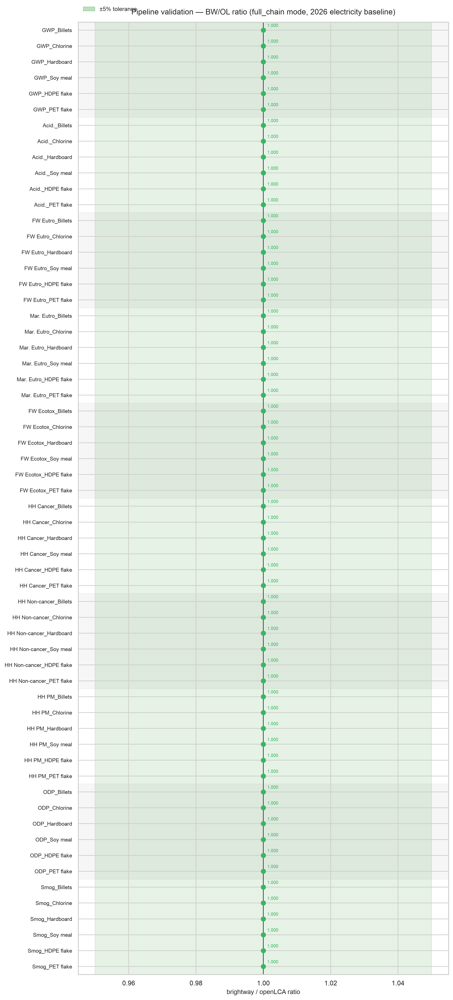
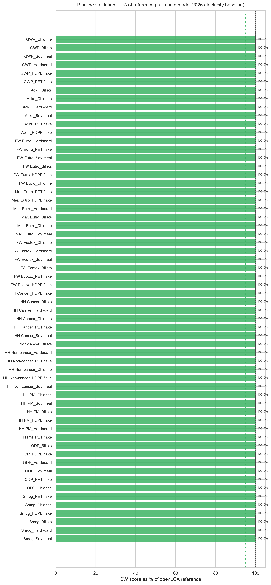

# Validating an open-source USLCI + TRACI pipeline against openLCA

**The short version:** I built an LCA pipeline on brightway that reads USLCI processes,
handles allocation, and applies TRACI 2.2 — a fully open, EPA-aligned stack with no ecoinvent
license required. To check it's trustworthy, I ran nine processes through both my pipeline and
openLCA (the reference tool) and compared the results. **All 100 category × process results agree
within 0.1% — every cell rounds to a ratio of 1.000.** Getting the last cells there (petroleum
refining's toxicity categories) uncovered and fixed a real importer bug, detailed below. The result
is a drop-in, license-free background-data engine that reproduces openLCA exactly.

---

## Why bother

If you want life-cycle impact results in the US today, you usually reach for openLCA plus a
commercial database, or a licensed ecoinvent stack. Both cost money or lock you into a GUI.

USLCI (public, NREL/EPA) + TRACI 2.2 (EPA) + FEDEFL (EPA) are all free and open. The missing
piece is a *programmatic* engine that stitches them together correctly — parsing the JSON-LD,
doing co-product allocation the way the data authors intended, and characterizing against the
right flow list. This pipeline is that engine. This report is the evidence that it produces the
same numbers openLCA does.

## How the check works

The logic is simple: **feed both engines the exact same data and see if they disagree.**

- Same source files. Both engines read the identical USLCI JSON-LD bundles (I confirmed the
  process definitions are byte-for-byte identical going in).
- Same method. Both use TRACI 2.2, characterizing against the same FEDEFL flow list.
- Same scope. Full supply chain, per 1 kg of reference product, all 10 TRACI categories.

Because the inputs are identical, **any difference in the output is the pipeline's doing** — not a
data-vintage artifact. That's the whole point of comparing against openLCA rather than against
published literature numbers.

Nine test processes, chosen to span different sectors and — more importantly — different
allocation styles, since allocation is where an LCA importer is most likely to be quietly wrong.

They run as **two builds**, because the US electricity baseline renames its grid node between
releases (same name, different UUID) and a build can only carry one vintage. Every case is compared
against an openLCA export computed on the matching vintage:

| Process | Sector | Allocation | Build | Worst-case disagreement |
|---|---|---|---|---|
| Petroleum refining; at refinery | Petroleum / energy | Physical, 9 products | 2025 | **0.00 %** |
| Corn; whole plant; at field | Agriculture | Economic (degenerate — see below) | 2025 | 0.00 % |
| Portland cement; at plant | Minerals | None (single-output) | 2025 | 0.00 % |
| Steel; billets; at plant | Metals | None (foreground control) | both | 0.00 % |
| **Chlorine; chlor-alkali electrolysis** | **Chemicals** | **Physical, 3 products** | 2026 | 0.00 % |
| **Hardboard; at hardboard plant** | **Wood products** | **Physical, 7 products** | 2026 | 0.00 % |
| **Soybean oil; crude, degummed** | **Agriculture / food** | **Physical, 2 products** | 2026 | 0.00 % |
| Recycled HDPE flake; at plant | Plastics recycling | Causal (consumed co-product) | 2026 | 0.00 % |
| Recycled PET flake; at plant | Plastics recycling | Causal (consumed co-product) | 2026 | 0.00 % |

The three **physical** cases added 2026-07-23 matter more than the count suggests: they are the first
*non-degenerate* allocation grids in the test set. Chlorine splits three ways (NaOH 0.5453 / Cl₂
0.4357 / H₂ 0.019), hardboard seven ways (0.8634 → 0.0016), soybean two (meal 0.8051 / oil 0.1949).
Before them the only real physical grid under test was petroleum's — and **economic** allocation
cannot be tested against USLCI at all: a census of all 1,342 USLCI processes found every one of the
29 that declare `ECONOMIC_ALLOCATION` assigns 0.0 or 1.0, one product taking 100% of the burden. The
corn case covers that degenerate path; nothing in the database exercises a real economic split.

Note also that `Soybean oil; crude, degummed; at plant` declares **soy meal** as its quantitative
reference, not the oil it is named for, so both engines report soy meal. That is USLCI's modelling.

## The result

Every one of the 100 results lands on 1.000 — full agreement to at least three significant figures.

**2025-vintage build** — petroleum, corn, cement, steel:


**2026-vintage build** — steel, HDPE flake, PET flake, chlorine, hardboard, soy meal:



*Each dot is one impact category for one process; the vertical line is perfect agreement (ratio =
1.0). The green band is ±5%. All 100 dots sit exactly on the line.*

- **100 / 100** results within 0.1% — numerically identical for practical purposes
- **0** cells outside 1%
- Largest single disagreement across all nine cases: **0.00077 %**
- The 2026 build is tighter still: all 60 of its cells agree within **0.001 %**

Cement and steel reproduce openLCA to 4–7 significant figures; corn and petroleum now match just as
tightly. Petroleum was the last to get there — its toxicity categories sat at ~1.05 until a single
importer bug was found and fixed (next section), after which all ten of its categories snapped to
1.000.

## How the petroleum residual was closed

Petroleum was the last case to reach agreement. Its ecotoxicity, cancer, and non-cancer scores had
run high against the reference for a long time (~1.027 in early builds, drifting to ~1.05 later). The
root cause, found 2026-07-21, was **a single importer bug — brightway did not honor USLCI's
`isAvoidedProduct` flag** — and fixing it snapped all ten petroleum categories to 1.000.

The trail:

- **Petroleum's toxicity is ~99% grid electricity.** A per-activity contribution analysis put nearly
  the entire ecotoxicity / cancer / non-cancer score on the US-average grid node, with the direct
  emissions of every other process negligible. So the gap had to be an electricity-routing effect.
- **One node carried the whole gap, with the wrong sign.** openLCA's "MSW landfilling of mixed MSW"
  process contributes **−0.072** to petroleum's ecotoxicity (a *credit*); brightway's contributed
  **+0.072** (a *burden*). Same magnitude, opposite sign — and that 0.145 flip equals the entire
  petroleum ecotoxicity gap (2.68 → 2.82), identically for all three toxicity categories.
- **Why the sign flip.** The USLCI landfilling process recovers landfill-gas electricity that
  displaces grid power, recorded as an electricity exchange with `isInput=true` **and
  `isAvoidedProduct=true`** (91.97 kWh). openLCA credits avoided products (subtracts them); `setup/03`
  had no `isAvoidedProduct` handling and imported the exchange as ordinary consumption — turning a
  grid-electricity *credit* into a grid-electricity *burden*. Since petroleum's toxicity is almost
  all grid electricity, that one exchange was the whole story.

**The fix** (`setup/03`) sign-flips avoided-product technosphere exchanges into credits — a
first-principles correctness change (honor the flag per openLCA semantics), not a tweak aimed at these
four processes. There are 15 such exchanges per bundle (landfilling, MSW combustion, sulfuric acid,
sulfur, ethylene glycol, …), so the fix brought **all 40** cells then in the test set to exact
agreement, not just the three toxicity cells it was chased down for; corn and cement tightened from
~0.1–0.5% residuals to 1.000 as well. The five cases added afterwards landed on 1.000 on first run —
a fair test of a fix made on first principles rather than fitted to the cases that motivated it.

This **supersedes the earlier "petroleum residual" diagnosis** (a 2026-07-17 investigation had
attributed the ~1.027 to openLCA charging a pre-correction crude-oil electricity value). That was a
misattribution: there was no crude-electricity discrepancy — openLCA computed the correct value
throughout, and the residual was always brightway's mishandled landfill-gas credit. The 2026-07-20
waste-treatment output-linking fix was itself correct; it simply *exposed* this dormant bug by pulling
the landfilling process into the supply chains for the first time. The full chronological trail
(including the superseded diagnosis, kept on the record) is in
[`validation/VALIDATION_LOG.md`](../validation/VALIDATION_LOG.md) and [`DEVLOG.md`](DEVLOG.md).

## How the numbers got here — the debugging arc

The headline agreement was *reached*, not assumed. It's worth seeing how, because the process is the
real evidence that these numbers were validated rather than fit.

Petroleum's toxicity categories did not start near 1.0. In the first full-chain run they sat at
roughly **2.0×** openLCA (human-health cancer 2.03, non-cancer 2.13, ecotoxicity 2.11). Rather than
tune the output, the gap was traced to genuine bugs in the importer:

1. **Co-product allocation factor.** A multi-output process consumed through a *co-product* exchange
   was being built on the *reference* product's allocation factor (0.219) instead of the co-product's
   own native factor (0.052) — inflating everything reached through that path. Fixed by applying each
   exchange's own target-product allocation factor.
2. **Causal allocation flattened.** The remaining petroleum residual was a `CAUSAL_ALLOCATION`
   process being collapsed to a mass fraction, over-attributing a forest-residue feedstock by 1.83×.
   Fixed by honoring each exchange's own causal factor.

Those two fixes moved petroleum from **2.0× to ~1.03**. Equally important, **two comfortable
explanations were disproven and kept on the record**: an early "petroleum trace-metal vintage" story
and an "electricity-Vanadium" mystery both turned out to be *setup* artifacts, not pipeline bugs, and
that reversal is logged rather than erased. The governing rule throughout was **VALIDATE, do not
FIT** — a change landed only if it was a first-principles correctness fix that applies to any dataset,
never a tweak to make the test cases agree. The five processes added on 2026-07-23 were validated
after every fix in this report had already landed, and they reproduced openLCA immediately.

The full chronological trace — every run, wrong theory, and fix — is in
[`validation/VALIDATION_LOG.md`](../validation/VALIDATION_LOG.md); the engineering narrative is in
[`DEVLOG.md`](DEVLOG.md).

## Honest scope

This is a *validation in progress*, not a finished certification.

- **Five processes so far** (four in the locked 2025 table, plus recycled-HDPE-flake on a 2026-grid
  build). They span five sectors and every allocation method — including the causal co-product
  *consumption* path, which HDPE exercises via the MRF-sorting processes and reproduces within 0.01%.
  The pipeline logic is process-agnostic (it special-cases nothing about these five). But the strongest
  guard against "the code was fit to these examples" is more examples — the plan is to pull additional
  processes from other manufacturing sectors and re-run this same check. (Recycled-PET-flake is a sixth
  candidate — it builds and solves, but has no openLCA reference export yet.)
- **Steel is the foreground-only control, by design — not a fourth full-chain case.** The steel
  billets bundle is a single process with no upstream supply chain, so for steel full-chain ≡ direct.
  That is the point of including it: it is the **Layer 1 control** in the layered validation design
  (see `validation/VALIDATION_LOG.md`, "Validation design") — the same aggregated inventory vector
  characterized by both engines, isolating LCIA math and biosphere mapping from the technosphere
  solve. Chosen early so that any discrepancy could be **localized**: a gap that shows up in steel
  implicates the foreground layer (CFs, unit conversion, flow mapping); a gap that shows up only in
  petroleum/corn/cement implicates the background (parser, allocation, provider linking); a gap in
  both implicates the combination. Steel reproduces openLCA at 1.000 on all ten categories, so the
  foreground layer is clean and residuals elsewhere are attributable to the solve — which is exactly
  how the petroleum residual was eventually cornered.
  The honest corollary stands: steel exercises **none** of the technosphere solve, so genuine
  full-chain coverage rests on petroleum, corn, and cement (plus HDPE flake on the 2026 build). It is
  also not extensible — a 2026-07-23 census found USLCI's steel datasets are labelled unit processes
  while being strictly foreground, with the entire upstream aggregated into a single elementary-flow
  inventory (the large `Steel; * coil; at plant` datasets carry ~740 exchanges and ~690 elementary
  flows with **zero** default-provider inputs). Full-chain steel is not available in this database, so
  steel stays in the role it was chosen for.
- **Reproducibility is ~1e-14, not bit-for-bit, and depends on the build's composition.** Every
  number here is reproducible in the sense that matters — re-running reproduces the ±0.1% agreement
  with openLCA — but the absolute scores move in roughly the 14th significant figure depending on
  which bundles share the database, because brightway's sparse solve sums in a matrix-dependent
  order. A petroleum-only build differs from the published table by ~1e-14. That is float
  arithmetic, about twelve orders of magnitude below anything an LCA conclusion rests on, and it is
  why the replication gate is a tolerance rather than a byte comparison.
- **Avoided products are still only lightly exercised.** The `isAvoidedProduct` fix that closed
  petroleum is a general correctness change, but the test cases activate only a handful of
  avoided-product exchanges (chiefly the landfill-gas electricity credit). One rare variant — a
  negative-amount avoided product ("steel from combustion") — is in no case's active chain, so it
  remains untested.
- **Economic allocation is covered only in its degenerate form, and cannot be covered otherwise
  with USLCI data.** All 29 USLCI processes declaring `ECONOMIC_ALLOCATION` use factors of exactly
  0.0 or 1.0 (census, 2026-07-23): one product absorbs everything, co-products get nothing. Corn
  already covers that path. No process in the database splits a burden economically, so the economic
  *arithmetic* is unverified — not because it was skipped, but because the data cannot exercise it.
  Physical and causal allocation are tested against real splits.
- **Electricity boundary matters.** Both engines were run with the US Electricity Baseline mounted
  and the US-average grid provider linked; a mismatch there would confound the comparison (see
  appendix).

For the intended use — an open, EPA-aligned background-data engine you can script — the evidence
here is sufficient: on identical inputs, this pipeline reproduces openLCA.

---
---

# Appendix — technical detail

Everything below is for readers who want to audit the claim. The main body stands on its own
without it.

## A. Environment

Both engines and all data sources, pinned to the versions used for these results.

| Component | Version |
|---|---|
| openLCA (reference tool) | 2.6 |
| brightway `bw2data` / `bw2calc` / `bw2io` | 4.7 / 2.5.0 / 0.9.17 |
| `lciafmt` (TRACI loader) | 1.2.0 |
| `fedelemflowlist` (FEDEFL) | 1.3.1 |
| `olca-schema` | 2.4.0 |
| pandas / numpy / scipy | 3.0.3 / 2.4.6 / 1.17.1 |
| Python | 3.11.15 (canonical conda env `fedefl-build-bw25` per `environment.yml`; the locked results were computed in a legacy-named build env, `asp-lca-bw25` — same pinned package set) |
| TRACI 2.2 method | file `v1.2.0`; method object `1.4.0`; `@id 52ce6d64-…`; 10 categories |
| US Electricity Baseline | `v1.2025-06.0` (openLCA library package — the version openLCA computed against) |
| FEDEFL biosphere | 332,133 flows, keyed by UUID |

Per-file SHA-256 hashes for every input are pinned in
[`validation/README.md`](../validation/README.md) and [`validation/VALIDATION_LOG.md`](../validation/VALIDATION_LOG.md),
alongside the validation harness (`validation/05_validate_uslci.py`, `validation/06_visualize_validation.py`)
and the locked result CSVs — all in **this** repo. The bulky openLCA reference exports (~130 MB of
xlsx) are hash-pinned there but not yet redistributed with the repo (hosting decision pending); a
replicator can regenerate them in openLCA 2.6 by following `VALIDATION_LOG.md`.

## B. Data-input parity (unit-process metadata + exchange counts)

Both engines ingest the same JSON-LD. This table is **not** a brightway-vs-openLCA count comparison —
it audits how each process's exchanges map from the raw USLCI file into brightway, showing the import
is lossless except for cutoffs. The invariant to read across the columns is:

> **brightway = USLCI file − cutoffs**, and openLCA drops the *identical* cutoffs.

So all three engines see the same surviving exchanges. "Cutoffs" are inputs with no producer process
in USLCI; openLCA drops these identically (verified: a provider-resolution audit over all 1,707
technosphere links found **0** ambiguous resolutions, and of 262 flows with no in-bundle producer,
only 1 exists anywhere in full USLCI, and openLCA cuts it off too at ~1e-6). The `product-out` column
is the reference/co-product outputs, which are not stored as brightway exchanges (see the note below),
so it has no brightway counterpart by design.

| Process | Ref product (native) | Alloc | Loc | USLCI file: tech-in / elem / product-out | brightway: tech / bio | Cutoffs (= file − bw) |
|---|---|---|---|---|---|---|
| Petroleum refining | Diesel, 0.2523 L | PHYSICAL | US | 16 / 276 / 9 | 15 / 275 | 1 tech, 1 elem |
| Corn; whole plant | Corn, 1.0 kg | ECONOMIC | US | 12 / 62 / 2 | 11 / 62 | 1 tech |
| Portland cement | Cement, 1.0 kg | NONE | US | 21 / 36 / 1 | 9 / 34 | 12 tech, 2 elem |
| Steel; billets | Steel billets, 1.0 kg | NONE | RNA | 1 / 92 / 1 | 0 / 91 | 1 tech, 1 elem |

(Multi-output processes import as one activity built on the reference product's yield and
allocation share; the product outputs themselves are not stored as brightway exchanges, which is
why "out" counts don't carry over.)

## C. LCIA method parity (characterization factors)

**C1 — Cross-engine CF counts.** For every category, the number of CFs brightway loads equals the
number of generic (non-located) factors in openLCA's own TRACI 2.2 source. Exact match, all 10.

| Category | openLCA generic CFs | brightway CFs loaded | Match |
|---|---|---|---|
| Acidification | 221 | 221 | ✓ |
| Eutrophication (Freshwater) | 128 | 128 | ✓ |
| Eutrophication (Marine) | 391 | 391 | ✓ |
| Freshwater ecotoxicity | 129,120 | 129,120 | ✓ |
| Global warming | 1,530 | 1,530 | ✓ |
| Human health – cancer | 31,059 | 31,059 | ✓ |
| Human health – non-cancer | 23,001 | 23,001 | ✓ |
| Human health – particulate matter | 136 | 136 | ✓ |
| Ozone depletion | 1,615 | 1,615 | ✓ |
| Smog formation | 13,498 | 13,498 | ✓ |

The two eutrophication categories ship spatial variants (25,472 and 82,917 factors); the pipeline
selects the **generic** variant to match openLCA, correctly reducing them to 128 and 391. Picking
the US-national variant instead would inflate freshwater ~2.8× and deflate marine ~0.15× — a
deliberate, documented toggle (`EUTRO_LOCATION`), defaulted to generic for openLCA parity.

**C2 — Internal match rate.** How TRACI factors flow through the loader into brightway. After
mapping names to FEDEFL UUIDs and applying the location filter, **every** surviving factor matches
a biosphere flow — **zero unmatched** in every category. (FEDEFL-UUID keying guarantees this; there
is no name-matching step to go wrong.)

| Category | TRACI raw | FEDEFL-mapped | after location filter | matched to biosphere | unmatched |
|---|---|---|---|---|---|
| Acidification | 13 | 221 | 221 | 221 | 0 |
| Eutrophication (Freshwater) | 20,670 | 440,960 | 128 | 128 | 0 |
| Eutrophication (Marine) | 28,922 | 1,315,984 | 391 | 391 | 0 |
| Freshwater ecotoxicity | 22,662 | 129,120 | 129,120 | 129,120 | 0 |
| Global warming | 91 | 1,530 | 1,530 | 1,530 | 0 |
| Human health – cancer | 5,427 | 31,059 | 31,059 | 31,059 | 0 |
| Human health – non-cancer | 3,933 | 23,001 | 23,001 | 23,001 | 0 |
| Human health – particulate matter | 8 | 136 | 136 | 136 | 0 |
| Ozone depletion | 96 | 1,615 | 1,615 | 1,615 | 0 |
| Smog formation | 1,173 | 13,498 | 13,498 | 13,498 | 0 |

## D. What "validation layer" means

The comparison is run at two depths, so a disagreement can be localized rather than just observed.

- **Direct mode (isolates the LCIA math).** Take one process's *own* emissions only, characterize
  in both engines. Any gap is a characterization-factor, unit, or flow-mapping issue — the
  chemistry, not the supply chain.
- **Full-chain mode (isolates the system solve).** Run the whole upstream supply chain. This is the
  headline table. A gap here that *isn't* in direct mode points at the parser, allocation, or the
  linear-algebra solve — how the network is wired, not how any single flow is scored.

The mental model behind the petroleum investigation: **are the inputs to the two computations
identical, or is the divergence in the solve?** Direct mode answers the first; full-chain answers
the second. Where direct-mode exports exist, direct-mode CFs match exactly (Appendix C), which is what
localized the former petroleum residual to the solve — specifically the avoided-product sign bug in
how one supply-chain node was imported, now fixed.

The LCIA-math check does not rest on petroleum alone. Steel has no linked upstream, so its direct and
full-chain scores are bit-identical and its standard export doubles as a direct check on a second,
independent set of 92 elementary flows. What only petroleum currently covers is separating a
process's *own* emissions from its background — and that split is strongly case-specific: petroleum's
direct emissions are under 0.01% of its full-chain result, while cement's reach 76%.

## E. Full results — brightway / openLCA ratio (full chain, per 1 kg)

| Category | Petroleum | Corn | Cement | Steel |
|---|---|---|---|---|
| Global warming | 1.000 | 1.000 | 1.000 | 1.000 |
| Acidification | 1.000 | 1.000 | 1.000 | 1.000 |
| Human health – particulate matter | 1.000 | 1.000 | 1.000 | 1.000 |
| Smog formation | 1.000 | 1.000 | 1.000 | 1.000 |
| Ozone depletion | 1.000 | 1.000 | 1.000 | 1.000 |
| Freshwater ecotoxicity | 1.000 | 1.000 | 1.000 | 1.000 |
| Human health – cancer | 1.000 | 1.000 | 1.000 | 1.000 |
| Human health – non-cancer | 1.000 | 1.000 | 1.000 | 1.000 |
| Eutrophication (Freshwater) | 1.000 | 1.000 | 1.000 | 1.000 |
| Eutrophication (Marine) | 1.000 | 1.000 | 1.000 | 1.000 |

Source: `validation_full_chain_results.csv`. Every cell agrees to at least three significant figures
(max deviation < 0.1%). Steel's ecotox/non-cancer/marine values are negative (avoided-burden credits
from scrap recovery); ratios there are ~1.0000000.

The 2026-vintage build (`validation_full_chain_results_2026.csv`) adds 60 further cells — steel,
HDPE flake, PET flake, chlorine, hardboard, soy meal — all within **0.001%**, max deviation
0.00077%:



## F. Tolerance ladder

| Band | Margin from 1.000 | 2025 build (40) | 2026 build (60) | Total (100) |
|---|---|---|---|---|
| Strict | ≤ 0.1% | 40 | 60 | **100** |
| Acceptable | ≤ 1% | 0 | 0 | 0 |
| Investigate / justify | ≤ 5% | 0 | 0 | 0 |
| Above tolerance | > 5% | 0 | 0 | 0 |

All 100 cells are Strict — every one within 0.1% of openLCA, and the 2026 build's 60 are within
0.001%. (Before the `isAvoidedProduct` fix, three petroleum toxicity cells sat above ±5% and several
more between 0.1% and 1%; the fix moved every cell into the Strict band.)

## G. Example practitioner visualizations

Beyond validation, the pipeline emits standard LCA charts straight from its results CSVs
(`06_visualize.py`, matplotlib/seaborn — no external tooling). Two families are shown below for
three of the test cases, to demonstrate the output is presentation-ready.

**Process contribution — 100%-stacked, all 10 categories.** Which upstream processes drive each
impact category. Petroleum's toxicity categories are dominated by the grid-electricity node (the
same structure that framed the residual investigation); cement is split between its own kiln, the
grid, and coal.


**Foreground vs background.** How much of each category is the process's own direct (gate)
emissions versus its upstream supply chain.


## Reproducing this

Everything below runs in **this** repo — setup, the practitioner steps, and the validation harness
that regenerates the Appendix E/F numbers and the hero chart. See
[`validation/README.md`](../validation/README.md) for the full replication guide and the SHA256-pinned
asset manifest.

```
# one-time setup, per machine
setup/00_build_flow_conversion_table.py → 01 → 02 → 03b → 03

# contribution data for the practitioner charts (Appendix G), one run per process
general/04_run_lca.py --uuid <UUID> --contributions contrib_<name>.csv   # ×4, then concatenate
                                                                         #  → lca_contributions.csv
general/06_visualize.py          # → charts/general/*.png

# validation scores + hero chart (Appendix E, F)
validation/05_validate_uslci.py  # VALIDATION_MODE = "full_chain" → validation_full_chain_results.csv
                                 #   an empty `git diff` on that CSV IS the byte-for-byte parity check
validation/06_visualize_validation.py   # → charts/validation/*.png
```

The openLCA reference exports the harness diffs against are hash-pinned in `validation/README.md`;
until a hosting decision is made they are assembled locally (or regenerated in openLCA 2.6).
